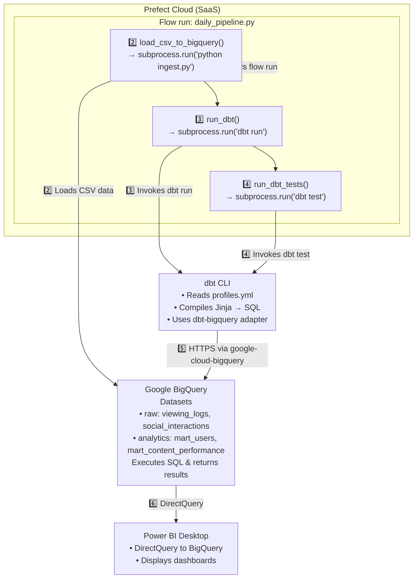
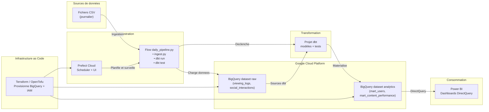

## Orchestration Prefect / dbt / Power BI

Diagramme de séquence du pipeline quotidien, modélisé en Mermaid :

## Architecture globale du POC

Vue d'ensemble des composants (provisionnement, orchestration, stockage et restitution) :

